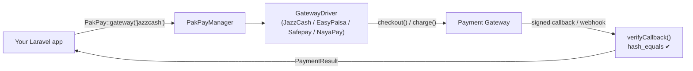
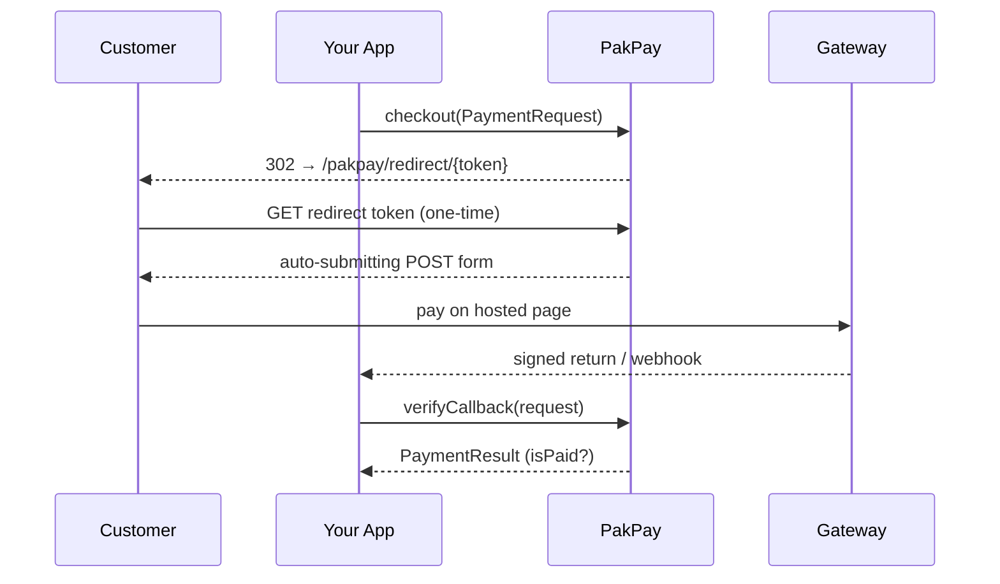

# PakPay

[](CHANGELOG.md)
[](https://github.com/imabbas8)
[](https://debugflow.com)
[](#requirements)
[](#requirements)
[](#testing)
[](#license)

A single, unified Laravel API for accepting payments through Pakistani payment gateways
(JazzCash, EasyPaisa, Safepay, NayaPay, PayFast, Raast).

Built and maintained by **[Abbas Aslam](https://github.com/imabbas8)** at **[Debug Flow](https://debugflow.com)**.

```php
PakPay::gateway('jazzcash')->checkout($request);   // hosted redirect
PakPay::gateway('jazzcash')->charge($request);     // direct wallet
PakPay::gateway('jazzcash')->verifyCallback($req); // signed callback
```

One contract for every gateway. Every driver verifies its own callback signature with a constant-time comparison (`hash_equals`) and refuses to fake flows it does not support.

> **Status:** **JazzCash**, **EasyPaisa**, **Safepay**, **NayaPay** implemented. **PayFast** and **Raast** are scaffolded (resolve and throw `UnsupportedFlowException` until implemented).

## Table of contents

1. [What is PakPay? (simple words)](#what-is-pakpay-simple-words) 👈 **start here**
2. [How it works](#how-it-works)
3. [Requirements](#requirements)
4. [Install](#install)
5. [Configuration](#configuration) · [all env settings](#all-environment-settings-at-a-glance)
6. [Usage](#usage) — [⚠️ imports first](#read-this-first--you-must-import-the-classes-) · [full controller example](#complete-copy-paste-example-controller--routes)
7. [Class & variable reference](#class--variable-reference) — every class, every variable
8. [Gateway capability matrix](#gateway-capability-matrix)
9. [Security model](#security-model)
10. [Troubleshooting (common errors)](#troubleshooting-common-errors)
11. [Testing](#testing)
12. [Developer](#developer) · [Company](#company) · [Contributing](#contributing) · [License](#license)

> **New here?** Read **[What is PakPay?](#what-is-pakpay-simple-words)** below, then
> copy the **[full controller example](#complete-copy-paste-example-controller--routes)** — that's all you need to take your first payment.

## What is PakPay? (simple words)

Imagine you have an online shop. A customer wants to **pay you money**. In Pakistan
people pay with **JazzCash, EasyPaisa, Safepay, NayaPay**, and others. Each one
works differently and is hard to set up.

**PakPay is your helper.** You learn **one** simple way, and PakPay talks to all
those payment apps for you. 🙌

> Think of PakPay like a **cashier** at a shop. You just say *"take 150 rupees from
> this customer"* — the cashier knows how to handle cash, card, or wallet. You
> don't need to learn each machine.

### A payment, told like a story 📖

1. 🛒 A customer clicks **"Pay"** on your website.
2. 🧾 Your app tells PakPay: *"Please collect **PKR 150** for order #1001."*
3. ➡️ PakPay sends the customer to **JazzCash / EasyPaisa** to pay.
4. ✅ The customer pays and comes **back** to your website.
5. 🔒 PakPay checks *"Is this payment real, or did someone fake it?"* and tells you
   **paid** or **not paid**. You then show *"Thank you!"* or *"Try again."*

That's the whole idea. PakPay does the hard, scary parts (signing, security,
talking to each gateway). You only write a few lines.

### The 3 baby steps 🍼

| Step | What you do | Where |
|:----:|-------------|-------|
| **1** | Install the package | `composer require pak-pay/pak-pay` |
| **2** | Put your secret keys (from the gateway) in your `.env` file | [Configuration](#configuration) |
| **3** | Write **2 tiny functions**: one to start the payment, one to receive the result | [Full example](#complete-copy-paste-example-controller--routes) |

The smallest possible payment looks like this 👇 (don't worry, the full example is below):

```php
// Step 3a — start the payment (send the customer to the gateway)
return PakPay::gateway('jazzcash')->checkout($request);

// Step 3b — when the customer comes back, check if they really paid
$result = PakPay::gateway('jazzcash')->verifyCallback($request);
if ($result->isPaid()) {
    // 🎉 money received — give the customer their order
}
```

**One golden rule for beginners:** at the very top of your PHP file you must add
the *import* lines (these tell PHP where PakPay lives). If you forget them you get
a *"Class not found"* error — see [imports first](#read-this-first--you-must-import-the-classes-).

```php
use PakPay\PakPay\Facades\PakPay;
use PakPay\PakPay\DTOs\PaymentRequest;
use PakPay\PakPay\DTOs\Customer;
```

Ready for the details? Keep reading 👇

## How it works

One facade → one manager → the gateway driver you pick. The driver signs the
outgoing payload and verifies the incoming callback signature.



**Hosted checkout (redirect) sequence:**



> These diagrams render as images on GitHub. The badges at the top of this file
> are also live images (developer, company, PHP, Laravel, tests, license).

## Requirements

- PHP `^8.0` — runs on **every** PHP 8 line (8.0, 8.1, 8.2, 8.3, 8.4).
- Laravel `8` → `13` (`illuminate/*` `^8 || ^9 || ^10 || ^11 || ^12 || ^13`)

> The package source deliberately avoids PHP 8.1-only syntax (native `enum`,
> `readonly` properties) so it installs cleanly on PHP 8.0. See
> [Payment states](#payment-states) for how this affects `$result->state`.

## Install

```bash
composer require pak-pay/pak-pay
php artisan vendor:publish --tag="pakpay-config"
```

The service provider and `PakPay` facade are auto-discovered.

## Configuration

A single `mode` switch flips every gateway between sandbox and production:

```env
PAKPAY_MODE=sandbox        # or: production
PAKPAY_GATEWAY=jazzcash    # default gateway
```

Optional production settings:

```env
PAKPAY_ROUTE_PREFIX=pakpay              # URL prefix for the hosted-redirect route
JAZZCASH_HOSTED_SEND_PASSWORD=true      # set false to keep pp_Password out of the browser form
```

The redirect route's middleware is configurable via `config('pakpay.route.middleware')`
(default `['web']`).

### All environment settings at a glance

Copy the block you need into your app's `.env`. Only fill in the gateways you use.

| Setting | Default | What it does |
|---------|---------|--------------|
| `PAKPAY_MODE` | `sandbox` | Flips **every** gateway between `sandbox` and `production` endpoints. |
| `PAKPAY_GATEWAY` | `jazzcash` | Default gateway used when you call `PakPay::checkout()` without `gateway()`. |
| `PAKPAY_ROUTE_PREFIX` | `pakpay` | URL prefix for the hosted-redirect route (`/{prefix}/redirect/{token}`). |
| **JazzCash** | | |
| `JAZZCASH_MERCHANT_ID` | — | Merchant ID (`pp_MerchantID`). |
| `JAZZCASH_PASSWORD` | — | Merchant password (`pp_Password`). |
| `JAZZCASH_INTEGRITY_SALT` | — | HMAC-SHA256 signing salt. |
| `JAZZCASH_RETURN_URL` | — | Where JazzCash posts the signed result. |
| `JAZZCASH_CURRENCY` | `PKR` | Transaction currency. |
| `JAZZCASH_LANGUAGE` | `EN` | Hosted form language. |
| `JAZZCASH_HOSTED_SEND_PASSWORD` | `true` | Set `false` to keep `pp_Password` out of the browser form. |
| **EasyPaisa** | | |
| `EASYPAISA_STORE_ID` | — | Store ID from your onboarding pack. |
| `EASYPAISA_HASH_KEY` | — | 16-byte AES key used for `merchantHashedReq`. |
| `EASYPAISA_ACCOUNT_NUM` | — | Merchant account number. |
| `EASYPAISA_RETURN_URL` | — | Signed-return URL. |
| **Safepay** | | |
| `SAFEPAY_CLIENT_KEY` | — | Public key (safe for the browser / Smart Button). |
| `SAFEPAY_SECRET_KEY` | — | Secret API key (server-side only). |
| `SAFEPAY_WEBHOOK_SECRET` | — | Webhook signing secret. |
| `SAFEPAY_RETURN_URL` | — | Success return URL. |
| `SAFEPAY_CANCEL_URL` | — | Cancel return URL. |
| `SAFEPAY_CURRENCY` | `PKR` | Transaction currency. |
| **NayaPay** | | |
| `NAYAPAY_MERCHANT_ID` | — | Merchant ID. |
| `NAYAPAY_API_KEY` | — | API key. |
| `NAYAPAY_HASH_KEY` | — | HMAC signing key. |
| `NAYAPAY_RETURN_URL` | — | Signed-return URL. |
| `NAYAPAY_CURRENCY` | `PKR` | Transaction currency. |
| **PayFast / Raast** | — | Scaffolded — `PAYFAST_*` / `RAAST_*` keys reserved, drivers not implemented yet. |

### JazzCash

Credentials come from your JazzCash merchant portal (Integration → API keys).

```env
JAZZCASH_MERCHANT_ID=
JAZZCASH_PASSWORD=
JAZZCASH_INTEGRITY_SALT=
JAZZCASH_RETURN_URL=https://your-app.test/payments/jazzcash/return
```

### EasyPaisa

Credentials come from your EasyPaisa (Telenor Microfinance Bank) merchant onboarding pack.

```env
EASYPAISA_STORE_ID=
EASYPAISA_HASH_KEY=          # 16-byte AES key
EASYPAISA_ACCOUNT_NUM=
EASYPAISA_RETURN_URL=https://your-app.test/payments/easypaisa/return
```

### Safepay

Keys come from the Safepay dashboard (Developers → API keys; Webhooks for the signing secret).

```env
SAFEPAY_CLIENT_KEY=          # public key (safe for the browser / Smart Button)
SAFEPAY_SECRET_KEY=          # secret API key (server-side only)
SAFEPAY_WEBHOOK_SECRET=      # webhook signing secret
SAFEPAY_RETURN_URL=https://your-app.test/payments/safepay/return
SAFEPAY_CANCEL_URL=https://your-app.test/payments/safepay/cancel
```

### NayaPay

Credentials come from your NayaPay (Arc) merchant onboarding pack.

```env
NAYAPAY_MERCHANT_ID=
NAYAPAY_API_KEY=
NAYAPAY_HASH_KEY=
NAYAPAY_RETURN_URL=https://your-app.test/payments/nayapay/return
```

### PayFast / Raast

Scaffolded only — env keys (`PAYFAST_*`, `RAAST_*`) exist in `config/pakpay.php` but the drivers are not implemented yet.

## Usage

Amounts are always integers in **paisa** (1 PKR = 100).

### Read this first — you MUST import the classes ⚠️

PakPay's classes live in the `PakPay\PakPay\...` namespace. In **every** file
where you write `PaymentRequest`, `Customer`, or `PakPay`, you must add the
matching `use` line at the top of the file (right under `namespace App\Http\...`).

If you forget, PHP looks for the class in **your** namespace and you get:

```
Class "App\Http\Controllers\PaymentRequest" not found
```

That is **not** a bug — it just means the `use` import is missing. Fix = add:

```php
use PakPay\PakPay\Facades\PakPay;
use PakPay\PakPay\DTOs\PaymentRequest;
use PakPay\PakPay\DTOs\Customer;
```

### Complete copy-paste example (controller + routes)

A full, working controller. Copy it as-is, then change the gateway/credentials.

```php
<?php

namespace App\Http\Controllers;

use Illuminate\Http\Request;
use PakPay\PakPay\Facades\PakPay;          // the facade
use PakPay\PakPay\DTOs\PaymentRequest;     // the payment you build
use PakPay\PakPay\DTOs\Customer;           // the paying customer
use PakPay\PakPay\Exceptions\PakPayException;

class CheckoutController extends Controller
{
    // 1) Start a payment → send the customer to the gateway's hosted page.
    public function pay()
    {
        $request = new PaymentRequest(
            amount: 150_00,            // PKR 150.00 (always in paisa)
            orderId: 'ORDER-' . uniqid(),
            description: 'Order payment',
        );

        return PakPay::gateway('jazzcash')->checkout($request); // returns a redirect
    }

    // 2) The gateway sends the customer back here (set this as your RETURN_URL).
    public function callback(Request $request)
    {
        try {
            // Verifies the signature first; throws if tampered/unsigned.
            $result = PakPay::gateway('jazzcash')->verifyCallback($request);
        } catch (PakPayException $e) {
            return redirect('/payment-failed')->withErrors($e->getMessage());
        }

        if ($result->isPaid()) {
            // Mark your order paid. Store $result->transactionId for refunds/status.
            return redirect('/thank-you');
        }

        return redirect('/payment-failed');
    }
}
```

Routes (`routes/web.php`):

```php
use App\Http\Controllers\CheckoutController;

Route::get('/pay', [CheckoutController::class, 'pay']);
Route::match(['get', 'post'], '/payments/jazzcash/return', [CheckoutController::class, 'callback']);
```

> The return route must match your `JAZZCASH_RETURN_URL` in `.env`. Use `post`
> for gateways that POST the result back, `get` for those that redirect with a
> query string — `match(['get','post'], ...)` covers both.

### Hosted checkout (redirect)

```php
use PakPay\PakPay\Facades\PakPay;
use PakPay\PakPay\DTOs\PaymentRequest;

$request = new PaymentRequest(
    amount: 150_00,            // PKR 150.00
    orderId: 'ORDER-1001',
    description: 'Order #1001',
);

return PakPay::gateway('jazzcash')->checkout($request);
// 302 → /pakpay/redirect/{token} → auto-submitting POST form → gateway
```

### Direct wallet charge (JazzCash Mobile Wallet)

```php
use PakPay\PakPay\DTOs\Customer;

$request = new PaymentRequest(
    amount: 150_00,
    orderId: 'ORDER-1002',
    customer: new Customer(
        mobile: '03019680302',
        cnicLast6: '123456',   // last 6 digits of CNIC (pp_CNIC)
    ),
);

$result = PakPay::gateway('jazzcash')->charge($request);

if ($result->isPaid()) {
    // $result->transactionId, $result->amount, $result->raw
}
```

### Verifying a callback / return

```php
use Illuminate\Http\Request;

Route::post('/payments/jazzcash/return', function (Request $request) {
    // Throws SignatureVerificationException on a tampered / unsigned payload.
    $result = PakPay::gateway('jazzcash')->verifyCallback($request);

    return $result->isPaid()
        ? redirect('/thank-you')
        : redirect('/payment-failed');
});
```

### Status & refund

```php
$status = PakPay::gateway('jazzcash')->status('T20260101120000ABCDEF');
$refund = PakPay::gateway('jazzcash')->refund('T20260101120000ABCDEF', 50_00);
```

### Payment states

Every gateway's own status codes are normalised into one vocabulary exposed on
`$result->state` and `$status->state`. To keep the package running on PHP 8.0,
these are **plain lowercase strings** held as constants on `PakPay\PakPay\Enums\PaymentState`
(not a native `enum`):

```php
use PakPay\PakPay\Enums\PaymentState;

$result = PakPay::gateway('jazzcash')->verifyCallback($request);

// Compare directly with === (the constant is just the string 'paid'):
if ($result->state === PaymentState::PAID) { /* ... */ }

// Or use the convenience helpers:
$result->isPaid();                              // success && state === PAID
PaymentState::isSuccessful($result->state);     // true only for PAID
PaymentState::isFinal($result->state);          // PAID | FAILED | CANCELLED | REFUNDED
```

| Constant | Value | Meaning |
|----------|-------|---------|
| `PaymentState::PENDING`    | `pending`    | Created, no money moved yet |
| `PaymentState::PROCESSING` | `processing` | Redirected / OTP issued, awaiting completion |
| `PaymentState::PAID`       | `paid`       | Funds captured |
| `PaymentState::FAILED`     | `failed`     | Declined or abandoned |
| `PaymentState::CANCELLED`  | `cancelled`  | Cancelled before completion |
| `PaymentState::REFUNDED`   | `refunded`   | Funds returned |
| `PaymentState::UNKNOWN`    | `unknown`    | Gateway state PakPay could not map |

### EasyPaisa

```php
PakPay::gateway('easypaisa')->checkout($request);   // hosted redirect
PakPay::gateway('easypaisa')->charge($request);     // Mobile Account (OTP)
PakPay::gateway('easypaisa')->verifyCallback($req); // signed return
```

### Safepay

```php
// Hosted Advanced Checkout (obtains a passport token + inits an order).
return PakPay::gateway('safepay')->checkout($request);

// Or hand the tracker to the drop-in Smart Payment Button (JS) on the frontend:
$data = PakPay::gateway('safepay')->smartButtonData($request);
// $data = ['environment', 'clientKey', 'tracker', 'orderId', 'amount', 'currency']

// Webhook (raw body + X-SFPY-Signature header verified with hash_equals):
$result = PakPay::gateway('safepay')->verifyCallback($request);
```

Safepay does not accept raw card data on your server, so `charge()` throws
`UnsupportedFlowException`. The passport token is cached (~55 min) and
regenerated automatically on a `401`.

### NayaPay

```php
return PakPay::gateway('nayapay')->checkout($request);   // hosted redirect (embed)
$result = PakPay::gateway('nayapay')->verifyCallback($request); // signed return
```

NayaPay's direct card API needs PCI compliance and is intentionally not built —
`charge()` throws `UnsupportedFlowException`.

If a gateway does not support a flow, a `UnsupportedFlowException` is thrown — the
package never fakes a result (e.g. EasyPaisa `refund()`, Safepay `charge()`).

## Class & variable reference

Every public class, what each variable means, **where** you use it and **how**.
All DTO properties are public, so you read them directly (`$result->state`).

### File-by-file map — which variable lives in which file

A quick "where is everything" table. Each **file** holds some **variables**, and
you use them in the listed place. (Detailed tables for each one follow below.)

| File | Variables it defines | Where you use them |
|------|----------------------|--------------------|
| `src/DTOs/PaymentRequest.php` | `amount`, `orderId`, `currency`, `description`, `customer`, `returnUrl`, `meta` | You **build** this and pass it to `checkout()` / `charge()`. |
| `src/DTOs/Customer.php` | `name`, `email`, `mobile`, `cnicLast6` | You **build** this and put it inside `PaymentRequest->customer` (needed for `charge()`). |
| `src/DTOs/PaymentResult.php` | `success`, `state`, `transactionId`, `orderId`, `amount`, `gatewayCode`, `message`, `raw` | You **read** these from what `charge()` / `verifyCallback()` returns. |
| `src/DTOs/PaymentStatus.php` | `state`, `transactionId`, `amount`, `gatewayCode`, `message`, `raw` | You **read** these from what `status()` returns. |
| `src/DTOs/RefundResult.php` | `success`, `transactionId`, `refundId`, `amount`, `gatewayCode`, `message`, `raw` | You **read** these from what `refund()` returns. |
| `src/Enums/PaymentState.php` | `PENDING`, `PROCESSING`, `PAID`, `FAILED`, `CANCELLED`, `REFUNDED`, `UNKNOWN` | You **compare** `$result->state === PaymentState::PAID`. |
| `src/Facades/PakPay.php` | the `PakPay` facade | Entry point: `PakPay::gateway('jazzcash')->...`. |
| `src/PakPayManager.php` | `gateway($name)` resolver | `PakPay::gateway('easypaisa')` picks the driver. |
| `config/pakpay.php` | `default`, `mode`, `route.prefix`, `route.middleware`, `gateways.*` | You **set** these via `.env` (see [env settings](#all-environment-settings-at-a-glance)). |

### Config/env variable — which gateway file reads it

When you fill a key in `.env`, this is the **driver file** that actually uses it:

| `.env` key | Config path | Read by (driver file) |
|------------|-------------|------------------------|
| `JAZZCASH_MERCHANT_ID`, `JAZZCASH_PASSWORD`, `JAZZCASH_INTEGRITY_SALT`, `JAZZCASH_RETURN_URL`, `JAZZCASH_CURRENCY`, `JAZZCASH_LANGUAGE`, `JAZZCASH_HOSTED_SEND_PASSWORD` | `pakpay.gateways.jazzcash.*` | `src/Drivers/JazzCashDriver.php` |
| `EASYPAISA_STORE_ID`, `EASYPAISA_HASH_KEY`, `EASYPAISA_ACCOUNT_NUM`, `EASYPAISA_RETURN_URL` | `pakpay.gateways.easypaisa.*` | `src/Drivers/EasyPaisaDriver.php` |
| `SAFEPAY_CLIENT_KEY`, `SAFEPAY_SECRET_KEY`, `SAFEPAY_WEBHOOK_SECRET`, `SAFEPAY_RETURN_URL`, `SAFEPAY_CANCEL_URL`, `SAFEPAY_CURRENCY` | `pakpay.gateways.safepay.*` | `src/Drivers/SafepayDriver.php` |
| `NAYAPAY_MERCHANT_ID`, `NAYAPAY_API_KEY`, `NAYAPAY_HASH_KEY`, `NAYAPAY_RETURN_URL`, `NAYAPAY_CURRENCY` | `pakpay.gateways.nayapay.*` | `src/Drivers/NayaPayDriver.php` |
| `PAYFAST_*`, `RAAST_*` | `pakpay.gateways.payfast.*`, `…raast.*` | `src/Drivers/PayFastDriver.php`, `RaastDriver.php` (scaffolds) |
| `PAKPAY_MODE`, `PAKPAY_GATEWAY`, `PAKPAY_ROUTE_PREFIX` | `pakpay.mode`, `pakpay.default`, `pakpay.route.prefix` | `src/PakPayManager.php`, `src/PakPayServiceProvider.php` |

### `PaymentRequest` — what you build and pass in

`PakPay\PakPay\DTOs\PaymentRequest` — describes the payment you want to collect.
Pass it to `checkout()` and `charge()`.

| Variable | Type | Required | Default | Where/how to use |
|----------|------|:--------:|---------|------------------|
| `amount` | `int` | ✅ | — | Amount in **paisa** (1 PKR = 100). `150_00` = PKR 150. Must be > 0 or it throws `InvalidArgumentException`. |
| `orderId` | `string` | ✅ | — | Your unique order/reference id. Must not be empty. Echoed back in `$result->orderId`. |
| `currency` | `string` | ❌ | `'PKR'` | ISO currency code. Pakistani gateways use `PKR`. |
| `description` | `?string` | ❌ | `null` | Shown to the customer on the hosted page. |
| `customer` | `?Customer` | ❌ | `null` | A `Customer` object — **required for `charge()`** (wallet needs a mobile). |
| `returnUrl` | `?string` | ❌ | `null` | Per-request override of the gateway's configured return URL. |
| `meta` | `array` | ❌ | `[]` | Arbitrary data echoed back where the gateway supports it. |

```php
use PakPay\PakPay\DTOs\PaymentRequest;

$request = new PaymentRequest(
    amount: 150_00,          // PKR 150.00
    orderId: 'ORDER-1001',
    description: 'Order #1001',
);

$request->amountAsDecimal();                 // "150.00" (paisa → major-unit string)
PaymentRequest::fromArray(['amount' => 15000, 'order_id' => 'ORDER-1']); // from an array
```

### `Customer` — who is paying

`PakPay\PakPay\DTOs\Customer`. Attach it to a `PaymentRequest`. No card data is
ever stored here.

| Variable | Type | Where/how to use |
|----------|------|------------------|
| `name` | `?string` | Customer full name (optional). |
| `email` | `?string` | Customer email (optional; some gateways email a receipt). |
| `mobile` | `?string` | MSISDN, e.g. `03019680302`. **Required for JazzCash/EasyPaisa wallet `charge()`.** |
| `cnicLast6` | `?string` | Last 6 digits of CNIC — required by some wallet APIs (JazzCash `pp_CNIC`). |

```php
use PakPay\PakPay\DTOs\Customer;

$customer = new Customer(mobile: '03019680302', cnicLast6: '123456');
Customer::fromArray(['mobile' => '03019680302', 'cnic_last6' => '123456']);
```

### `PaymentResult` — what `charge()` and `verifyCallback()` return

`PakPay\PakPay\DTOs\PaymentResult`.

| Variable | Type | Where/how to use |
|----------|------|------------------|
| `success` | `bool` | Did the gateway accept the payment? |
| `state` | `string` | Normalised state — a `PaymentState::*` constant (e.g. `'paid'`). |
| `transactionId` | `?string` | Gateway transaction id (store this for `status()` / `refund()`). |
| `orderId` | `?string` | Your order id, echoed back. |
| `amount` | `?int` | Captured amount in paisa, if reported. |
| `gatewayCode` | `?string` | Raw gateway response code. |
| `message` | `?string` | Human-readable gateway message. |
| `raw` | `array` | The **full** raw gateway payload — log this for auditing/disputes. |
| `isPaid()` | `bool` (method) | `true` only when `success && state === PaymentState::PAID`. Use this for your branch. |

```php
$result = PakPay::gateway('jazzcash')->charge($request);

if ($result->isPaid()) {
    Order::find($result->orderId)?->markPaid($result->transactionId);
} else {
    Log::warning('Payment failed', $result->raw);
}
```

### `PaymentStatus` — what `status()` returns

`PakPay\PakPay\DTOs\PaymentStatus`.

| Variable | Type | Where/how to use |
|----------|------|------------------|
| `state` | `string` | Normalised `PaymentState::*` constant. |
| `transactionId` | `string` | The transaction you queried. |
| `amount` | `?int` | Amount in paisa, if reported. |
| `gatewayCode` | `?string` | Raw gateway status code. |
| `message` | `?string` | Human-readable message. |
| `raw` | `array` | Full raw payload. |
| `isPaid()` | `bool` (method) | `true` if the queried transaction is in the PAID state. |

### `RefundResult` — what `refund()` returns

`PakPay\PakPay\DTOs\RefundResult`.

| Variable | Type | Where/how to use |
|----------|------|------------------|
| `success` | `bool` | Was the refund accepted? |
| `transactionId` | `string` | The original transaction that was refunded. |
| `refundId` | `?string` | Gateway refund reference, if issued. |
| `amount` | `?int` | Refunded amount in paisa. |
| `gatewayCode` | `?string` | Raw gateway code. |
| `message` | `?string` | Human-readable message. |
| `raw` | `array` | Full raw payload. |

### `PaymentState` — the normalised states

`PakPay\PakPay\Enums\PaymentState` — string constants (see [Payment states](#payment-states)
for the full table and helpers `isSuccessful()` / `isFinal()` / `all()`).

### `GatewayDriver` — the five methods every gateway exposes

You reach these via `PakPay::gateway('name')->method(...)`.

| Method | Returns | Where/how to use | Throws |
|--------|---------|------------------|--------|
| `checkout(PaymentRequest)` | `RedirectResponse` | `return` it from a controller to send the customer to the hosted page. | `UnsupportedFlowException`, `GatewayException` |
| `charge(PaymentRequest)` | `PaymentResult` | Direct wallet/OTP charge (needs `customer->mobile`). | `UnsupportedFlowException`, `GatewayException` |
| `verifyCallback(Request)` | `PaymentResult` | Call in your return/webhook route — verifies the signature first. | `SignatureVerificationException`, `GatewayException` |
| `status(string $txnId)` | `PaymentStatus` | Query a transaction's current state. | `UnsupportedFlowException`, `GatewayException` |
| `refund(string $txnId, int $amount)` | `RefundResult` | Refund (full/partial), `$amount` in paisa. | `UnsupportedFlowException`, `GatewayException` |

> Safepay also exposes `smartButtonData(PaymentRequest): array` for the drop-in JS button.

### Exceptions — what to catch

| Exception (`PakPay\PakPay\Exceptions\…`) | When it is thrown |
|------------------------------------------|-------------------|
| `PakPayException` | Base class — catch this to handle any PakPay error. |
| `SignatureVerificationException` | A callback/webhook signature is missing, wrong, or replayed. **Never trust the payload when this throws.** |
| `UnsupportedFlowException` | The gateway does not support that flow (e.g. Safepay `charge()`). |
| `GatewayException` | Config missing or the gateway returned an error. |

### Config keys (`config/pakpay.php`)

Set via `.env` — see [All environment settings](#all-environment-settings-at-a-glance)
for the env names. Read at runtime with `config('pakpay.<key>')`:

| Config key | Env | Use |
|------------|-----|-----|
| `pakpay.default` | `PAKPAY_GATEWAY` | Gateway used when you don't pass one to `gateway()`. |
| `pakpay.mode` | `PAKPAY_MODE` | `sandbox` or `production` — flips every gateway's endpoints. |
| `pakpay.route.prefix` | `PAKPAY_ROUTE_PREFIX` | URL prefix for the hosted-redirect route. |
| `pakpay.route.middleware` | — | Middleware array for that route (default `['web']`). |
| `pakpay.gateways.<name>.*` | per-gateway `*` | Credentials + endpoints for each gateway. |

## Gateway capability matrix

| Gateway   | Hosted redirect | Direct charge        | PCI scope | Refund | Status | Webhook/return verify |
|-----------|:---------------:|----------------------|:---------:|:------:|:------:|:---------------------:|
| JazzCash  | ✅              | ✅ Mobile Wallet      | No        | ✅     | ✅     | ✅ HMAC-SHA256         |
| EasyPaisa | ✅              | ✅ Mobile Account/OTP | No        | ❌     | ✅     | ✅ HMAC-SHA256         |
| Safepay   | ✅              | ❌ (hosted/PCI)       | No        | ✅     | ✅     | ✅ HMAC-SHA256 webhook |
| NayaPay   | ✅              | ❌ (needs PCI)        | No        | ❌     | ✅     | ✅ HMAC-SHA256         |
| PayFast   | 🚧 scaffold     | 🚧                    | No        | 🚧     | 🚧     | 🚧                    |
| Raast     | 🚧 scaffold     | 🚧                    | No        | 🚧     | 🚧     | 🚧                    |

No raw card data ever touches your server — only hosted-redirect and
gateway-tokenized flows are supported.

## Security model

- Outgoing payloads are signed (JazzCash: HMAC-SHA256 over sorted `pp_*` fields
  with the Integrity Salt; EasyPaisa: AES-128-ECB `merchantHashedReq`).
- Incoming callbacks are verified with `hash_equals` (constant-time) before any
  field is trusted; failure throws `SignatureVerificationException`.
- Hosted-redirect payloads are stashed behind a one-time token (10-min TTL) and
  consumed once, so a redirect URL cannot be replayed.

## Troubleshooting (common errors)

| Error you see | Why | Fix |
|---------------|-----|-----|
| `Class "App\Http\Controllers\PaymentRequest" not found` | You wrote `new PaymentRequest(...)` but forgot the import, so PHP looked in your own namespace. | Add `use PakPay\PakPay\DTOs\PaymentRequest;` at the top of the file. Same for `Customer`, `PakPay`. |
| `Class "App\Http\Controllers\PakPay" not found` | Missing facade import. | Add `use PakPay\PakPay\Facades\PakPay;`. |
| `Target class [pakpay] does not exist` / facade is null | Package not discovered (rare). | Run `php artisan package:discover`, or register the provider/alias manually (see [Install](#install)). |
| `SignatureVerificationException` on a real callback | The signature didn't match — wrong secret, or the field/URL the gateway signs differs from what's configured. | Double-check the gateway's `*_INTEGRITY_SALT` / `*_HASH_KEY` / `*_WEBHOOK_SECRET` and the `// VERIFY` endpoint notes in `config/pakpay.php`. |
| `UnsupportedFlowException` | That gateway doesn't support that flow (e.g. Safepay `charge()`, EasyPaisa `refund()`). | Use a supported flow — see the [capability matrix](#gateway-capability-matrix). |
| `GuzzleHttp\... not found` on charge/status | Guzzle missing on older Laravel. | `composer require guzzlehttp/guzzle` (already a hard dependency of this package). |
| `PaymentRequest amount must be a positive integer (in paisa)` | You passed `0`, a negative, or rupees instead of paisa. | Pass paisa: PKR 150 → `150_00`. |
| Config values are `null` | `.env` not loaded / config cached. | Set the keys in `.env`, then `php artisan config:clear`. |

**Golden rule:** every PakPay class needs its `use` line. The imports you'll
need almost every time:

```php
use PakPay\PakPay\Facades\PakPay;
use PakPay\PakPay\DTOs\PaymentRequest;
use PakPay\PakPay\DTOs\Customer;
use PakPay\PakPay\Exceptions\PakPayException; // base exception to catch
```

## Testing

The suite is written in [Pest](https://pestphp.com). Every gateway HTTP call is
stubbed with `Http::fake()` — tests **never** hit a real endpoint and need **no
credentials**. Signing and verification are asserted against fixed
known-input → known-hash vectors.

### 1. Run the test suite

```bash
composer install        # installs dev deps (Pest, Testbench)
composer test           # or: vendor/bin/pest
```

Expected result: **52 passing tests (98 assertions)** — all green. ✅

> **Note on the dev toolchain.** The package *runtime* supports PHP `^8.0`, but
> the *test* dependencies do not all go that low: Pest 3 / Testbench 11 need PHP
> 8.2+. On PHP 8.0/8.1 Composer automatically resolves the older, compatible dev
> deps (Pest 1.x / Testbench 6.x) declared in `require-dev`, and the same suite
> runs. The library code itself ships **zero** PHP 8.1+ syntax, so it installs and
> runs on a bare PHP 8.0 app.

Useful variations:

```bash
vendor/bin/pest --filter="tampered"          # run only tests matching a name
vendor/bin/pest tests/Unit                    # run one directory
vendor/bin/pest tests/Feature/SafepayDriverTest.php   # run one file
vendor/bin/pest --coverage                    # coverage report (needs Xdebug/PCOV)
```

### 2. Run the standalone security demo

No Laravel app required — proves signing + verification end to end:

```bash
php examples/demo.php
```

It signs a JazzCash payload, accepts a genuine callback, and **rejects a
tampered one** (amount changed after signing).

### 3. What is covered

| Area | File |
|------|------|
| JazzCash signing/verify (vector, tamper, missing) | `tests/Unit/JazzCashSignatureTest.php` |
| EasyPaisa AES + return signature (vector, tamper) | `tests/Unit/EasyPaisaSignatureTest.php` |
| Safepay webhook signature (vector) | `tests/Unit/SafepaySignatureTest.php` |
| NayaPay signature (vector, verify, tamper) | `tests/Unit/NayaPaySignatureTest.php` |
| JazzCash flows: checkout/charge/status/refund/CNIC | `tests/Feature/JazzCashDriverTest.php` |
| EasyPaisa flows + unsupported refund | `tests/Feature/EasyPaisaDriverTest.php` |
| Safepay: order init, **401 token regen**, smart button, webhook, replay | `tests/Feature/SafepayDriverTest.php` |
| NayaPay: hosted checkout, unsupported charge, status | `tests/Feature/NayaPayDriverTest.php` |
| PayFast/Raast scaffolds throw `UnsupportedFlowException` | `tests/Feature/ScaffoldDriverTest.php` |
| Manager/factory resolution | `tests/Feature/ManagerTest.php` |
| One-time redirect token (no replay) | `tests/Feature/RedirectRouteTest.php` |

Each flow is tested for **success, failure, tampered signature (must throw),
unsupported flow (must throw)**, and — for Safepay — **expired token (401 →
regenerate)** and **replayed webhook**.

### 4. Test against multiple Laravel versions

The package targets Laravel 8 → 13. To test a specific version locally (use a
PHP version that the target Laravel supports — e.g. PHP 8.0 for Laravel 8):

```bash
composer require "laravel/framework:11.*" "orchestra/testbench:9.*" --dev --no-update
composer update --prefer-stable
vendor/bin/pest

# restore the broad constraint afterwards
composer require "orchestra/testbench:^6.0 || ^7.0 || ^8.0 || ^9.0 || ^10.0 || ^11.0" --dev
```

Testbench → Laravel map: `6.*`→8, `7.*`→9, `8.*`→10, `9.*`→11, `10.*`→12, `11.*`→13.
CI (`.github/workflows/ci.yml`) runs the full PHP 8.0–8.4 × Laravel 8–13 matrix
automatically on every push/PR.

**Verified locally** — every supported Laravel line was installed and the full
suite re-run against it:

| Laravel | Testbench | PHP | Pest | Result |
|:-------:|:---------:|:---:|:----:|:------:|
| 8       | 6.x       | 8.2 | 1.23 | ✅ 52 passed |
| 9       | 7.x       | 8.2 | 3.x  | ✅ 52 passed |
| 10      | 8.x       | 8.2 | 3.x  | ✅ 52 passed |
| 11      | 9.x       | 8.2 | 3.x  | ✅ 52 passed |
| 12      | 10.x      | 8.3 | 3.x  | ✅ 52 passed |
| 13 (`v13.15.0`) | 11.x | 8.4 | 3.x¹ | ✅ 52 passed |

¹ **Laravel 13 note.** The package itself runs fine on Laravel 13. The only catch
is the **test-only** dependency `pestphp/pest-plugin-laravel`, whose latest
release supports Laravel ≤ 12 — so a plain `composer require laravel/framework:13.*`
fails to resolve **in the test toolchain only**. The tests use Testbench's own
`$this->get()/assertStatus()` helpers (not the plugin), so CI simply removes the
plugin for the Laravel 13 jobs and the full suite passes:

```bash
composer remove --dev pestphp/pest-plugin-laravel --no-update
composer require "laravel/framework:13.*" "orchestra/testbench:11.*" --dev --no-update
composer update --prefer-stable --with-all-dependencies
vendor/bin/pest        # → 52 passed
```

PHP **8.0** and **8.1** aren't installed on the dev machine above, but the
library code contains zero 8.1+ syntax (see [§5](#5-php-version-compatibility)),
so it runs there unchanged — the CI matrix exercises 8.0 and 8.1 explicitly.

### 5. PHP-version compatibility

The library is written to the **PHP 8.0** baseline so it runs unchanged on every
PHP 8 release:

| Feature avoided | Why | Used instead |
|-----------------|-----|--------------|
| Native `enum` (8.1) | Not available on 8.0 | `PaymentState` class with `string` constants + static helpers |
| `readonly` properties (8.1) | Not available on 8.0 | Plain promoted constructor properties |

Everything else the package relies on — constructor property promotion, named
arguments, `match`, the nullsafe `?->` operator — is already valid PHP 8.0.
Verified by linting every `src/` file (`php -l`) and running the full Pest suite
(**52 passed**).

### 6. How the fakes work (writing your own test)

```php
use Illuminate\Support\Facades\Http;
use PakPay\PakPay\Facades\PakPay;
use PakPay\PakPay\DTOs\{PaymentRequest, Customer};

Http::fake([
    '*jazzcash*/wallet' => Http::response(['pp_ResponseCode' => '000'], 200),
]);

$result = PakPay::gateway('jazzcash')->charge(new PaymentRequest(
    amount: 10000,
    orderId: 'ORDER-1',
    customer: new Customer(mobile: '03019680302', cnicLast6: '123456'),
));

expect($result->isPaid())->toBeTrue();
```

To verify a callback in a test, sign the payload with the same driver, then
re-submit it (and assert that altering any field makes `verifyCallback()` throw).

### 7. Testing with real sandbox credentials

The unit/feature tests need nothing, but the **exact endpoint URLs and a few
field/hash details are marked `// VERIFY against official docs`** in the drivers
and `config/pakpay.php`. To validate against a live sandbox:

1. Put real sandbox credentials in `.env` and set `PAKPAY_MODE=sandbox`.
2. Run one transaction per flow and confirm the gateway accepts the signature
   and that `verifyCallback()` validates the real return/webhook payload.
3. Resolve every `// VERIFY` comment for that gateway against its docs.
4. When all flows pass in sandbox, switch `PAKPAY_MODE=production`.

## Developer

**Abbas Aslam**

- 💻 GitHub: [github.com/imabbas8](https://github.com/imabbas8)
- ✉️ Email: [imabbasaslam8@gmail.com](mailto:imabbasaslam8@gmail.com)
- 📦 Repository: [github.com/imabbas8/pak-pay](https://github.com/imabbas8/pak-pay)

## Company

**Debug Flow**

- 🌐 Website: [debugflow.com](https://debugflow.com)
- ✉️ Support: [support@debugflow.com](mailto:support@debugflow.com)

## Contributing

Issues and pull requests are welcome at
[github.com/imabbas8/pak-pay](https://github.com/imabbas8/pak-pay/issues).

```bash
git clone https://github.com/imabbas8/pak-pay.git
cd pak-pay
composer install
composer test
```

## License

PakPay is open-source software licensed under the **MIT license**.

© 2026 Abbas Aslam — [Debug Flow](https://debugflow.com).
